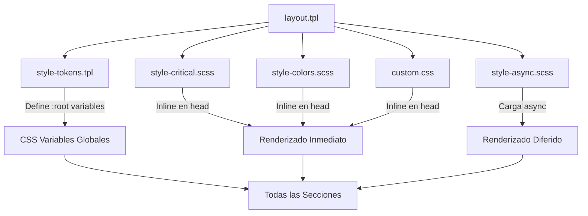
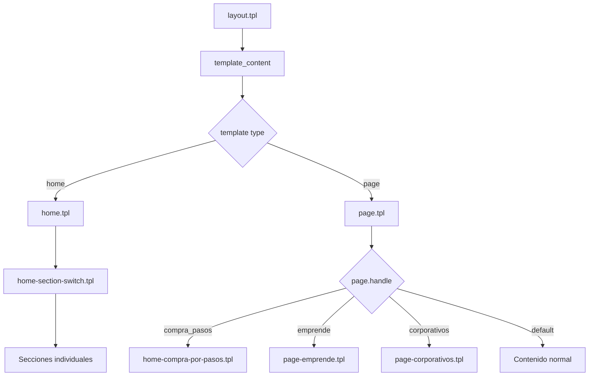
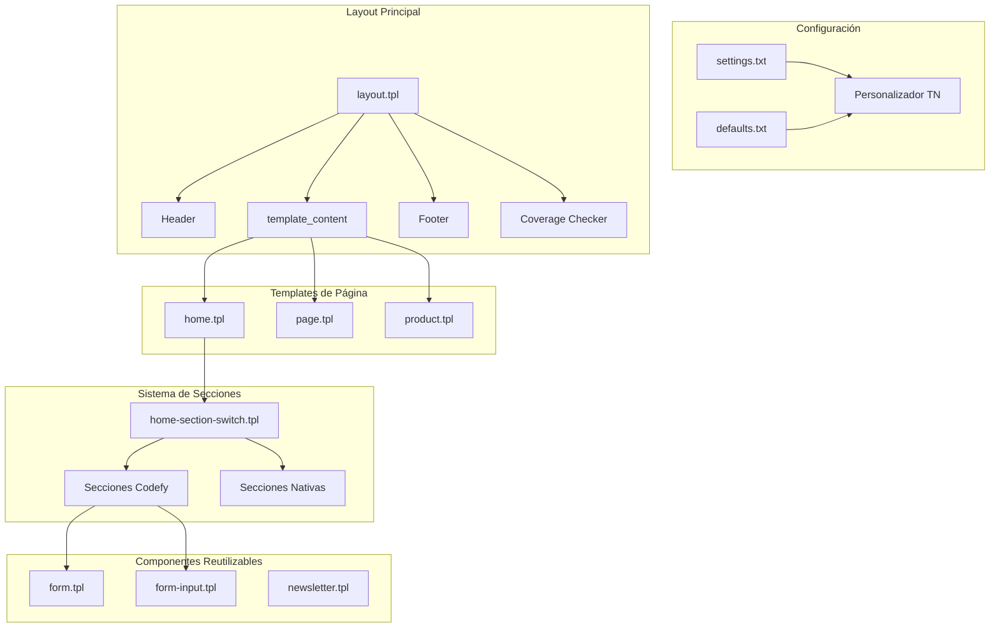

# Documentación Técnica del Template Scatola - Componentes Codefy

> **Documento técnico exhaustivo** que detalla la estructura del template, la creación de secciones, la composición de formularios y una descripción detallada de cada componente Codefy implementado.

---

## Tabla de Contenidos

1. [Estructura General del Template](#1-estructura-general-del-template)
2. [Sistema de Secciones del Home](#2-sistema-de-secciones-del-home)
3. [Composición de Formularios y Newsletter](#3-composición-de-formularios-y-newsletter)
4. [Secciones Codefy - Descripción Detallada](#4-secciones-codefy---descripción-detallada)
   - [Banner Custom (Codefy)](#41-banner-custom-codefy---side-banner)
   - [Carrusel Colecciones (Codefy)](#42-carrusel-colecciones-codefy)
   - [Carrusel de Videos (Codefy)](#43-carrusel-de-videos-codefy)
   - [Carrusel Productos con Filtros (Codefy)](#44-carrusel-productos-con-filtros-codefy)
   - [Iconos Información (Codefy)](#45-iconos-información-codefy)
   - [Información Compra por Pasos (Codefy)](#46-información-compra-por-pasos-codefy)
   - [Compra por Pasos (Codefy)](#47-compra-por-pasos-codefy)
   - [Regalos Empresariales (Codefy)](#48-regalos-empresariales-codefy)
   - [Emprende (Codefy)](#49-emprende-codefy)
   - [Formulario (Codefy)](#410-formulario-codefy)
   - [Galería Simple (Codefy)](#411-galería-simple-codefy)
5. [Verificador de Cobertura (Codefy)](#5-verificador-de-cobertura-codefy)
6. [Páginas Personalizadas (Codefy)](#6-páginas-personalizadas-codefy)
7. [Archivos de Configuración](#7-archivos-de-configuración)

---

## 0. Lenguajes y Tecnologías Utilizadas

### 0.1 Stack Tecnológico

| Tecnología | Uso Principal | Extensión de Archivos |
|------------|---------------|----------------------|
| **Twig** | Motor de plantillas | `.tpl` |
| **HTML5** | Estructura del contenido | Dentro de `.tpl` |
| **CSS3/SCSS** | Estilos y diseño | `.css`, `.scss` |
| **JavaScript (ES6+)** | Interactividad y lógica | `.js`, inline en `.tpl` |
| **JSON** | Configuración | `.json` |
| **SVG** | Iconos vectoriales | Inline en `.tpl` |

### 0.2 Twig (Motor de Plantillas)

**Ubicación:** Todos los archivos `.tpl`

Twig es el motor de plantillas utilizado por Tiendanube. Permite:

```twig
{# Comentarios #}
           {# Variables #}
{{ variable }}                          {# Impresión #}
...       {# Condicionales #}
... {# Bucles #}
            {# Inclusiones #}
{{ texto | translate }}                 {# Filtros #}
```

**Archivos principales con Twig:**
- `layouts/layout.tpl` - Layout principal
- `templates/*.tpl` - Templates de páginas
- `snipplets/**/*.tpl` - Componentes reutilizables
- `config/settings.txt` - Configuración (sintaxis especial)

### 0.3 HTML5

**Ubicación:** Dentro de archivos `.tpl`

```html
<!-- Estructura semántica -->
<section class="section-nombre" data-store="identificador">
    <div class="container">
        <header>...</header>
        <article>...</article>
        <footer>...</footer>
    </div>
</section>
```

**Características usadas:**
- Elementos semánticos (`<section>`, `<article>`, `<nav>`, `<figure>`)
- Atributos `data-*` para JavaScript
- Atributos de accesibilidad (`aria-*`, `role`)
- Lazy loading nativo (`loading="lazy"`)

### 0.4 CSS3 y SCSS

**Ubicaciones:**

| Archivo | Descripción |
|---------|-------------|
| `static/css/style-critical.scss` | CSS crítico (inline) |
| `static/css/style-async.scss` | CSS cargado async |
| `static/css/style-colors.scss` | Variables de colores |
| `static/css/style-tokens.tpl` | Tokens CSS (con Twig) |
| `static/css/custom.css` | Personalizaciones |
| **Inline en `.tpl`** | Estilos específicos de sección |

**Características CSS modernas usadas:**

```css
/* Variables CSS */
:root {
    --main-foreground: #2c2c2c;
    --accent-color: #ff6b9d;
}

/* Flexbox y Grid */
.container {
    display: grid;
    grid-template-columns: repeat(auto-fit, minmax(250px, 1fr));
}

/* Clamp para tipografía fluida */
.title {
    font-size: clamp(1.5rem, 4vw, 3rem);
}

/* Animaciones */
@keyframes floatXY { ... }

/* Media queries */
@media (max-width: 767px) { ... }
@media (prefers-reduced-motion: reduce) { ... }
```

### 0.5 JavaScript (ES6+)

**Ubicaciones:**

| Archivo/Ubicación | Descripción |
|-------------------|-------------|
| `static/js/store.js.tpl` | Lógica principal de la tienda |
| `static/js/external.js.tpl` | Librerías externas |
| `static/js/external-no-dependencies.js.tpl` | Librerías sin dependencias |
| **Inline `<script>` en `.tpl`** | Lógica específica de sección |

**Patrones utilizados:**

```javascript
// DOM Ready
document.addEventListener('DOMContentLoaded', function() { ... });

// Event delegation
container.addEventListener('click', function(e) {
    if (e.target.matches('.target')) { ... }
});

// Async/Await (cuando se usa fetch)
async function loadProducts() {
    const response = await fetch('/products');
    const data = await response.json();
}

// MutationObserver para detectar cambios
const observer = new MutationObserver(callback);
observer.observe(element, { childList: true, subtree: true });

// Intersection Observer para lazy loading
const io = new IntersectionObserver(entries => { ... });
```

**Librerías externas:**

| Librería | Versión | Uso |
|----------|---------|-----|
| jQuery | 1.11.1 | Compatibilidad legacy |
| Embla Carousel | Latest | Carruseles |
| Embla Autoplay | Latest | Autoplay de carruseles |
| Lazysizes | - | Lazy loading de imágenes |

### 0.6 Estructura de un Archivo `.tpl` Típico

```twig
{# ============================================
   Nombre de la Sección (Codefy)
   ============================================ #}

{# 1. TWIG: Variables y lógica #}





{# 2. HTML: Estructura #}
<section class="section-mi-seccion" data-store="home-mi-seccion">
    <div class="container">
        <h2>{{ settings.mi_seccion_title | translate }}</h2>
        
        
            <div class="item">
                
                <h3>{{ item.title }}</h3>
            </div>
        
    </div>
</section>

{# 3. CSS: Estilos (inline por sección) #}
<style>
.section-mi-seccion {
    padding: 3rem 0;
    background: {{ settings.mi_seccion_bg_color | default('#ffffff') }};
}

.section-mi-seccion .item {
    display: flex;
    gap: 1rem;
}

@media (max-width: 767px) {
    .section-mi-seccion {
        padding: 2rem 0;
    }
}
</style>

{# 4. JAVASCRIPT: Interactividad (inline por sección) #}
<script>
document.addEventListener('DOMContentLoaded', function() {
    var section = document.querySelector('.section-mi-seccion');
    
    // Lógica específica de la sección
    section.addEventListener('click', function(e) {
        if (e.target.matches('.item')) {
            // Acción
        }
    });
});
</script>


```

### 0.7 Mapa de Lenguajes por Directorio

```
scatola/
├── config/
│   ├── settings.txt      → Sintaxis propia de Tiendanube
│   └── defaults.txt      → Sintaxis propia de Tiendanube
│
├── layouts/
│   └── layout.tpl        → Twig + HTML + CSS inline + JS inline
│
├── snipplets/
│   ├── forms/
│   │   ├── form.tpl      → Twig + HTML
│   │   └── form-input.tpl→ Twig + HTML
│   ├── home/
│   │   └── *.tpl         → Twig + HTML + CSS inline + JS inline
│   └── svg/
│       └── icons.tpl     → SVG (inline)
│
├── static/
│   ├── css/
│   │   ├── *.scss        → SCSS (compilado)
│   │   └── *.css         → CSS
│   ├── js/
│   │   └── *.js.tpl      → Twig + JavaScript
│   └── fonts/
│       └── *.woff2       → Fuentes (binario)
│
└── templates/
    └── *.tpl             → Twig + HTML
```

### 0.8 Filtros Twig Específicos de Tiendanube

| Filtro | Descripción | Ejemplo |
|--------|-------------|---------|
| `translate` | Traduce texto multiidioma | `{{ 'Enviar' \| translate }}` |
| `static_url` | URL de archivo estático | `{{ 'image.jpg' \| static_url }}` |
| `settings_image_url` | URL de imagen de settings | `{{ img \| settings_image_url('large') }}` |
| `setting_url` | Procesa URLs de settings | `{{ link \| setting_url }}` |
| `escape` | Escapa caracteres | `{{ text \| escape('html') }}` |
| `raw` | Imprime sin escapar (para SVG) | `{{ svg_code \| raw }}` |
| `default` | Valor por defecto | `{{ var \| default('valor') }}` |
| `has_custom_image` | Verifica si existe imagen | `{{ 'img.jpg' \| has_custom_image }}` |

### 0.9 Sistema de Herencia y Estilos Compartidos

El template utiliza un sistema de **arquitectura CSS en capas** donde los estilos se heredan y comparten entre secciones a través de **CSS Variables (Custom Properties)** y una estrategia de carga optimizada.

#### 0.9.1 Arquitectura de Archivos CSS



#### 0.9.2 Orden de Carga en `layout.tpl`

```twig
<head>
    {# 1. TOKENS CSS - Variables globales (Twig + CSS) #}
    <style>
        
    </style>
    
    {# 2. CSS CRÍTICO - Inline para First Paint rápido #}
    {{ 'css/style-critical.scss' | static_url | static_inline }}
    
    {# 3. CSS COLORES - Variables de tema inline #}
    {{ 'css/style-colors.scss' | static_url | static_inline }}
    
    {# 4. CSS ASYNC - Cargado después del First Paint #}
    <link rel="stylesheet" href="{{ 'css/style-async.scss' | static_url }}" 
          media="print" onload="this.media='all'">
    
    {# 5. CSS PERSONALIZADO - Desde admin #}
    <style>{{ settings.css_code | raw }}</style>
    
    {# 6. CSS CUSTOM - Archivo local #}
    {{ 'css/custom.css' | static_url | static_inline }}
</head>
```

#### 0.9.3 CSS Variables (Tokens) - `style-tokens.tpl`

Este archivo es **el corazón del sistema de herencia**. Define todas las variables CSS que las secciones pueden usar:

```css
:root {
    /* ═══════════════════════════════════════════
       COLORES PRINCIPALES (heredados por todo)
    ═══════════════════════════════════════════ */
    --main-foreground: #2c2c2c;      /* Color de texto principal */
    --main-background: #ffffff;       /* Color de fondo principal */
    --accent-color: #ff6b9d;          /* Color de acento */
    
    /* ═══════════════════════════════════════════
       COLORES DE BOTONES
    ═══════════════════════════════════════════ */
    --button-background: #2c2c2c;
    --button-foreground: #ffffff;
    
    /* ═══════════════════════════════════════════
       COLORES POR SECCIÓN (opcionales)
    ═══════════════════════════════════════════ */
    --header-background: ...;
    --header-foreground: ...;
    --footer-background: ...;
    --footer-foreground: ...;
    --newsletter-background: ...;
    --coverage-button-background: ...;
    
    /* ═══════════════════════════════════════════
       VARIANTES DE OPACIDAD (auto-generadas)
    ═══════════════════════════════════════════ */
    --main-foreground-opacity-10: #2c2c2c1A;
    --main-foreground-opacity-20: #2c2c2c33;
    --main-foreground-opacity-30: #2c2c2c4D;
    /* ... más variantes ... */
    
    /* ═══════════════════════════════════════════
       TIPOGRAFÍA
    ═══════════════════════════════════════════ */
    --heading-font: 'Montserrat', sans-serif;
    --body-font: 'Open Sans', sans-serif;
    
    --h1: 32px;
    --h2: 28px;
    --h3: 24px;
    /* ... más tamaños ... */
    
    --font-huge: 24px;
    --font-large: 18px;
    --font-base: 14px;
    --font-small: 12px;
    
    --title-font-weight: 700;  /* o 400 si no está en negrita */
    
    /* ═══════════════════════════════════════════
       LAYOUT
    ═══════════════════════════════════════════ */
    --container-width: 1200px;
    --gutter: 15px;
    --gutter-double: 30px;
    
    /* ═══════════════════════════════════════════
       BORDES Y SOMBRAS
    ═══════════════════════════════════════════ */
    --border-radius: 4px;
    --border-solid: 1px solid;
    --shadow-distance: 0 0 5px;
}
```

#### 0.9.4 Cómo las Secciones Heredan Estilos

**Ejemplo: Una sección Codefy usando variables globales**

```twig
{# snipplets/home/home-mi-seccion.tpl #}

<section class="section-mi-seccion">
    <div class="container">
        <h2 class="mi-seccion-title">{{ title }}</h2>
        <p class="mi-seccion-text">{{ description }}</p>
        <a href="#" class="btn btn-primary">{{ cta_text }}</a>
    </div>
</section>

<style>
.section-mi-seccion {
    /* Hereda colores del tema */
    background: var(--main-background);
    color: var(--main-foreground);
}

.mi-seccion-title {
    /* Hereda fuente y peso de títulos */
    font-family: var(--heading-font);
    font-weight: var(--title-font-weight);
    font-size: var(--h2);
}

.mi-seccion-text {
    /* Hereda fuente del body */
    font-family: var(--body-font);
    font-size: var(--font-base);
    color: var(--main-foreground-opacity-70);
}

/* El botón .btn-primary ya hereda estilos de style-colors.scss */
/* No necesita definir background ni color */
</style>
```

#### 0.9.5 Clases Utilitarias Compartidas

El archivo `style-critical.scss` define clases que todas las secciones pueden usar:

| Clase | Propósito | Ejemplo |
|-------|-----------|---------|
| `.container` | Contenedor centrado con max-width | Grid Bootstrap |
| `.row`, `.col-*` | Sistema de grid | Layout responsivo |
| `.btn`, `.btn-primary`, `.btn-secondary` | Botones estilizados | CTAs |
| `.h1` - `.h6` | Tamaños de títulos | Headings |
| `.font-small`, `.font-large` | Tamaños de texto | Subtítulos |
| `.d-flex`, `.d-none` | Display utilities | Visibilidad |
| `.text-center`, `.text-left` | Alineación | Posicionamiento |
| `.mb-3`, `.mt-4`, `.p-3` | Márgenes y paddings | Espaciado |
| `.lazyload` | Lazy loading de imágenes | Performance |

#### 0.9.6 Estilos en `style-colors.scss` Compartidos

Este archivo define estilos que usan las variables CSS y son heredados automáticamente:

```scss
/* Todos los enlaces heredan estos estilos */
a {
    color: var(--main-foreground);
    transition: all 0.4s ease;
    &:hover {
        color: var(--main-foreground-opacity-50);
    }
}

/* Todos los botones .btn-primary heredan estos estilos */
.btn-primary {
    background-color: var(--button-background);
    color: var(--button-foreground);
}

/* Todos los placeholders heredan el color del tema */
.placeholder-color {
    background-color: var(--main-foreground-opacity-20);
}

/* Los modales heredan colores del tema */
.modal {
    color: var(--main-foreground);
    background-color: var(--main-background);
}

/* Los formularios heredan estilos del tema */
.form-control {
    color: var(--main-foreground);
    border: var(--border-solid) var(--main-foreground-opacity-30);
    font-family: var(--body-font);
}
```

#### 0.9.7 Estilos Inline vs Compartidos

**Cuándo usar estilos inline en la sección:**

| Situación | Usar Inline | Usar Compartido |
|-----------|-------------|-----------------|
| Estilos únicos de la sección | ✅ | ❌ |
| Layout específico (grid, posiciones) | ✅ | ❌ |
| Animaciones específicas | ✅ | ❌ |
| Colores que usan settings propios | ✅ | ❌ |
| Botones básicos | ❌ | ✅ `.btn-primary` |
| Tipografía | ❌ | ✅ Variables CSS |
| Espaciado básico | ❌ | ✅ `.mb-3`, `.p-4` |
| Grid del contenedor | ❌ | ✅ `.container`, `.row` |

**Ejemplo de combinación:**

```twig
<section class="section-custom mb-5"> {# mb-5 es compartido #}
    <div class="container"> {# container es compartido #}
        <h2 class="h2 text-center mb-4">Título</h2> {# h2, text-center, mb-4 compartidos #}
        <div class="custom-grid"> {# grid personalizado #}
            ...
        </div>
        <a class="btn btn-primary">CTA</a> {# btn-primary compartido #}
    </div>
</section>

<style>
/* Solo estilos ÚNICOS de esta sección */
.section-custom {
    background: {{ settings.custom_bg_color }}; /* Color específico del setting */
}

.custom-grid {
    display: grid;
    grid-template-columns: repeat(3, 1fr); /* Layout único */
    gap: 2rem;
}
</style>
```

#### 0.9.8 SCSS Mixins y Placeholders

El archivo `style-colors.scss` define mixins y placeholders reutilizables:

```scss
/* MIXINS - Se incluyen donde se necesiten */
@mixin text-decoration-none() {
    text-decoration: none;
    outline: 0;
    &:hover, &:focus {
        text-decoration: none;
        outline: 0;
    }
}

@mixin prefix($property, $value, $prefixes: ()) {
    @each $prefix in $prefixes {
        #{'-' + $prefix + '-' + $property}: $value;
    }
    #{$property}: $value;
}

/* PLACEHOLDERS - Se extienden con @extend */
%section-margin {
    margin-bottom: 70px;
}

%element-margin {
    margin-bottom: 20px;
}

%border-radius {
    border-radius: 3px;
}

%simplefade {
    transition: all 0.5s ease;
}

/* Uso: */
.mi-elemento {
    @extend %element-margin;
    @extend %border-radius;
    @include prefix(transition, all 0.4s ease, webkit ms moz o);
}
```

#### 0.9.9 Diagrama de Cascada de Estilos

```
┌─────────────────────────────────────────────────────────────────┐
│                     CASCADA DE ESTILOS                          │
├─────────────────────────────────────────────────────────────────┤
│                                                                 │
│  1. style-tokens.tpl (Variables :root)                         │
│     ↓                                                           │
│  2. style-critical.scss (Clases base + Bootstrap Grid)         │
│     ↓                                                           │
│  3. style-colors.scss (Estilos con variables)                  │
│     ↓                                                           │
│  4. style-async.scss (Estilos no críticos)                     │
│     ↓                                                           │
│  5. Estilos inline en secciones .tpl                           │
│     ↓                                                           │
│  6. custom.css (Personalizaciones)                             │
│     ↓                                                           │
│  7. settings.css_code (CSS desde admin)                        │
│                                                                 │
│  ─────────────────────────────────────────────────────────     │
│  MAYOR ESPECIFICIDAD = GANA                                    │
└─────────────────────────────────────────────────────────────────┘
```

#### 0.9.10 Ventajas de Este Sistema

| Ventaja | Descripción |
|---------|-------------|
| **Consistencia** | Todas las secciones usan los mismos colores, fuentes y espaciados |
| **Mantenibilidad** | Cambiar un color en `settings.txt` actualiza todo el sitio |
| **Performance** | CSS crítico inline + async reduce tiempo de carga |
| **DRY** | No repetir estilos comunes en cada sección |
| **Theming** | Fácil cambiar todo el tema desde el personalizador |
| **Especificidad controlada** | Los estilos inline de sección tienen la última palabra |

### 0.10 Errores Comunes y Restricciones (Error 500)

> [!CAUTION]
> Esta sección documenta las causas más comunes de **Error 500** en templates de Tiendanube. Un Error 500 significa que el servidor no pudo procesar el template debido a un error de sintaxis o una operación no permitida.

#### 0.10.1 Errores de Sintaxis Twig (Más Comunes)

| Error | ❌ Incorrecto | ✅ Correcto | Descripción |
|-------|---------------|-------------|-------------|
| **Llaves sin cerrar** | `{{ variable }` | `{{ variable }}` | Siempre cerrar con `}}` |
| **Tags sin cerrar** | `` | `...` | Todo `if/for/set` debe tener cierre |
| **Comillas mal cerradas** | `{{ 'texto }` | `{{ 'texto' }}` | Comillas deben coincidir |
| **Paréntesis sin cerrar** | `{{ func(arg }` | `{{ func(arg) }}` | Siempre cerrar paréntesis |
| **Pipe sin filtro** | `{{ variable | }}` | `{{ variable \| default('') }}` | Debe haber un filtro después del `\|` |
| **Comentario mal formado** | `{# comentario` | `{# comentario #}` | Cerrar con `#}` |

**Ejemplos de errores de bloque:**

```twig
{# ❌ ERROR 500: for sin endfor #}

    {{ item }}
{# Falta  #}

{# ❌ ERROR 500: if sin endif #}

    Contenido
{# Falta  #}

{# ❌ ERROR 500: elseif mal escrito #}

  {# ❌ Mal: "else if" separado #}


{# ✅ CORRECTO #}

   {# ✅ Bien: "elseif" junto #}

```

#### 0.10.2 Operaciones No Permitidas en Twig

| Operación | ❌ Causa Error 500 | ✅ Alternativa |
|-----------|-------------------|----------------|
| **Acceso a propiedad null** | `{{ product.variants.first.price }}` | `{{ product.variants.first.price \| default(0) }}` |
| **Método no existente** | `{{ array.push(item) }}` | Usar `merge`: `` |
| **Asignación en expresión** | `{{ x = 5 }}` | `` |
| **Funciones PHP directas** | `{{ date('Y-m-d') }}` | `{{ 'now' \| date('Y-m-d') }}` |
| **Incremento directo** | `{{ i++ }}` | `` |
| **Concatenación con +** | `{{ 'a' + 'b' }}` | `{{ 'a' ~ 'b' }}` |

**Ejemplo de acceso seguro a propiedades:**

```twig
{# ❌ ERROR 500 si product.variants es null o vacío #}
{{ product.variants.first.price }}

{# ✅ CORRECTO: Verificar antes de acceder #}

    {{ product.variants.first.price }}


{# ✅ ALTERNATIVA: Usar default #}
{{ product.variants.first.price | default('No disponible') }}
```

#### 0.10.3 Errores en `settings.txt`

| Error | ❌ Incorrecto | ✅ Correcto |
|-------|---------------|-------------|
| **Indentación incorrecta** | Sin espacios antes de `attribute` | 4 espacios antes de cada campo |
| **Tipo inexistente** | `type = color_picker` | `type = color` |
| **Valor incompatible** | `default = texto` (en checkbox) | `default = true` o `default = false` |
| **Falta attribute** | Solo `type = text` | `attribute = nombre` + `type = text` |
| **Caracteres especiales** | `description = Título "especial"` | `description = Título especial` |
| **Saltos de línea en valores** | Valor en múltiples líneas | Todo en una línea |

**Estructura correcta de un setting:**

```
{# ❌ ERROR 500: Indentación incorrecta #}
subtitle = Mi Sección
attribute = mi_setting
type = text

{# ✅ CORRECTO: Con 4 espacios de indentación #}
subtitle = Mi Sección

    attribute = mi_setting
    type = text
    description = Descripción del campo
    default = Valor por defecto
```

**Tipos válidos en settings.txt:**

| Tipo | Valores Aceptados | Ejemplo |
|------|-------------------|---------|
| `text` | Cualquier texto | `default = Hola mundo` |
| `textarea` | Texto multilínea | `default = Texto largo` |
| `checkbox` | `true` o `false` | `default = true` |
| `select` | Opciones definidas | Ver estructura abajo |
| `color` | Hex color | `default = #FF0000` |
| `image` | N/A (sin default) | Solo `attribute` y `type` |
| `font` | Nombre de fuente | `default = Montserrat` |
| `range` | Número | `default = 50` |
| `url` | URL válida | `default = https://example.com` |

#### 0.10.4 Errores en SCSS

| Error | ❌ Incorrecto | ✅ Correcto |
|-------|---------------|-------------|
| **Variable no definida** | `color: $mi-color;` | Definir `$mi-color: #000;` antes |
| **Anidamiento excesivo** | Más de 4 niveles | Limitar a 3-4 niveles |
| **Mixin inexistente** | `@include mi-mixin();` | Definir el mixin primero |
| **Sintaxis CSS inválida** | `background: url("img.jpg)` | `background: url("img.jpg")` |
| **Extend de selector no existente** | `@extend .no-existe;` | Solo extend de clases definidas |
| **Comentarios mal formados** | `/* comentario` | `/* comentario */` |

> [!WARNING]
> Tiendanube compila SCSS en el servidor. Un error de SCSS causa Error 500 en **todo el sitio**.

#### 0.10.5 Filtros y Funciones No Disponibles

**Filtros que NO existen en Tiendanube Twig:**

```twig
{# ❌ ERROR 500: Estos filtros no existen #}
{{ variable | json_encode }}      {# No disponible #}
{{ variable | abs }}              {# No disponible #}
{{ variable | sort }}             {# No disponible #}
{{ variable | reverse }}          {# No disponible #}
{{ variable | keys }}             {# No disponible #}
{{ variable | first | last }}     {# Encadenar así puede fallar #}

{# ✅ ALTERNATIVAS #}
{{ product.price | money }}       {# Formato de precio #}
{{ 'texto' | translate }}         {# Traducción #}
{{ image | settings_image_url }}  {# URL de imagen #}
```

**Funciones Twig estándar NO disponibles:**

| Función | Alternativa |
|---------|-------------|
| `range()` | Iterar manualmente con `for i in 1..5` |
| `date()` | Usar `\| date()` como filtro |
| `dump()` | No disponible (debug) |
| `include()` como función | Usar `` como tag |
| `block()` | Usar `` |

#### 0.10.6 Problemas con `include` y `embed`

```twig
{# ❌ ERROR 500: Ruta incorrecta #}



{# ✅ CORRECTO: Ruta relativa desde raíz del template #}


{# ❌ ERROR 500: Archivo no existe #}


{# ✅ CORRECTO: Verificar existencia o usar ignore missing #}


{# ❌ ERROR 500: Variables no pasadas correctamente #}


{# ✅ CORRECTO: Pasar como objeto #}

```

#### 0.10.7 Caracteres Especiales Problemáticos

| Caracter | Problema | Solución |
|----------|----------|----------|
| `{` o `}` en JavaScript | Twig intenta parsearlo | Usar `...` |
| `{{` en strings HTML | Se interpreta como Twig | Escapar o usar raw |
| `%}` en comentarios | Cierra tag prematuramente | Evitar en comentarios |
| Emojis en settings | Pueden romper encoding | Evitar emojis en defaults |
| `\n` literal | Rompe settings.txt | Mantener todo en una línea |

**Ejemplo con JavaScript:**

```twig
{# ❌ ERROR 500: Las llaves de JS se interpretan como Twig #}
<script>
const data = { name: "producto" };  {# Error: { } #}
</script>

{# ✅ CORRECTO: Usar verbatim #}
<script>

const data = { name: "producto" };

</script>

{# ✅ ALTERNATIVA: Generar JSON desde Twig #}
<script>
const data = {{ product | json_encode | raw }};
</script>
```

#### 0.10.8 Límites y Restricciones de Tiendanube

| Restricción | Límite | Consecuencia |
|-------------|--------|--------------|
| **Tamaño de archivo** | ~500KB por archivo | Error de carga si excede |
| **Profundidad de anidamiento** | ~10 niveles include | Error 500 |
| **Bucles infinitos** | Detectados | Timeout y Error 500 |
| **Número de settings** | ~500 por subtitle | Lentitud en personalizador |
| **Imágenes en settings** | Peso máximo ~2MB | Error al subir |
| **Tiempo de compilación** | ~30 segundos | Timeout si SCSS muy complejo |

#### 0.10.9 Checklist de Debugging Error 500

Cuando ocurre un Error 500, verificar en este orden:

```
□ 1. TWIG: ¿Todos los  tienen ?
□ 2. TWIG: ¿Todos los  tienen ?
□ 3. TWIG: ¿Las {{ }} y  están bien cerradas?
□ 4. TWIG: ¿Hay acceso a propiedades de objetos null?
□ 5. SETTINGS: ¿La indentación es correcta (4 espacios)?
□ 6. SETTINGS: ¿Los tipos son válidos?
□ 7. SETTINGS: ¿Los valores default son compatibles con el tipo?
□ 8. SCSS: ¿Las variables están definidas antes de usarse?
□ 9. SCSS: ¿Los paréntesis y llaves están balanceados?
□ 10. INCLUDE: ¿Las rutas de archivos son correctas?
□ 11. INCLUDE: ¿Los archivos incluidos existen?
□ 12. JS: ¿El código JS está dentro de verbatim si usa { }?
```

#### 0.10.10 Errores Silenciosos (No 500, Pero No Funcionan)

| Situación | Síntoma | Causa |
|-----------|---------|-------|
| Setting no aparece | Campo invisible en personalizador | Tipo incorrecto o fuera de subtitle |
| Valor siempre vacío | `{{ settings.mi_campo }}` = nada | Nombre del attribute con typo |
| Imagen no carga | Placeholder o roto | Ruta incorrecta al usar `static_url` |
| Sección no aparece | No se renderiza | `show` en false o no incluido en switch |
| Estilos no aplican | Sin efecto visual | Clase CSS con typo o conflicto de especificidad |
| JS no ejecuta | Sin interacción | Error de JS en consola del navegador |

#### 0.10.11 Buenas Prácticas para Evitar Errores

```twig
{# 1. SIEMPRE usar default para valores potencialmente vacíos #}
{{ settings.mi_titulo | default('Sin título') }}

{# 2. VERIFICAR antes de acceder a propiedades anidadas #}

    {{ product.variants.first.price }}


{# 3. USAR ternario para condiciones simples #}
{{ condition ? 'valor_si_true' : 'valor_si_false' }}

{# 4. ESCAPAR contenido dinámico en atributos #}
<div data-value="{{ variable | escape('html_attr') }}"></div>

{# 5. COMENTAR código en lugar de borrar para debugging #}
{#  #}

{# 6. PROBAR cambios incrementalmente #}
{# Subir un archivo a la vez, no todos juntos #}
```

---

## 1. Estructura General del Template

### 1.1 Arquitectura de Directorios

```
scatola/
├── config/
│   ├── settings.txt        # Configuraciones del personalizador
│   └── defaults.txt         # Valores por defecto
├── documentacion/           # Documentación del proyecto
├── layouts/
│   └── layout.tpl           # Layout principal HTML
├── snipplets/
│   ├── forms/               # Componentes de formularios
│   │   ├── form.tpl         # Template base de formularios
│   │   └── form-input.tpl   # Inputs reutilizables
│   ├── home/                # Secciones del home
│   │   ├── home-section-switch.tpl  # Router de secciones
│   │   └── home-*.tpl       # Secciones individuales
│   ├── header/              # Componentes del header
│   ├── footer/              # Componentes del footer
│   └── coverage/            # Verificador de cobertura
├── static/
│   ├── css/                 # Estilos
│   ├── js/                  # JavaScript
│   └── fonts/               # Fuentes personalizadas
└── templates/
    ├── home.tpl             # Página de inicio
    └── page.tpl             # Páginas institucionales
```

### 1.2 Flujo de Renderizado



### 1.3 Sistema de Configuración

El template utiliza un sistema de configuración basado en `settings.txt` que permite personalizar cada sección desde el panel de administración de Tiendanube.

**Estructura de una configuración típica:**

```
subtitle = Nombre de la Sección (Codefy)

    attribute = nombre_seccion_setting_name
    type = tipo_input
    description = Descripción del campo
    default = valor_por_defecto
```

---

## 2. Sistema de Secciones del Home

### 2.1 El Router de Secciones: `home-section-switch.tpl`

El archivo `snipplets/home/home-section-switch.tpl` actúa como un **router central** que determina qué sección renderizar basándose en el valor de `section_select`.

**Ubicación:** `snipplets/home/home-section-switch.tpl`

**Funcionamiento:**

```twig

    

    
        
    

    

    
{# ... más secciones ... #}

```

### 2.2 Secciones Codefy Disponibles

| Identificador | Nombre en Personalizador | Archivo Template |
|---------------|--------------------------|------------------|
| `side_banner` | Banner Custom (Codefy) | `home-side-banner.tpl` |
| `carrusel_secciones` | Carrusel Colecciones (Codefy) | `home-carrusel-secciones.tpl` |
| `video_carousel` | Carrusel de Videos (Codefy) | `home-video-carousel.tpl` |
| `carrusel_productos_filtros` | Carrusel Productos con Filtros (Codefy) | `home-carrusel-productos-filtros.tpl` |
| `iconos_informacion` | Iconos Información (Codefy) | `home-iconos-informacion.tpl` |
| `info_compra_pasos` | Información Compra por Pasos (Codefy) | `home-info-compra-pasos.tpl` |
| `formulario` | Formulario (Codefy) | `home-formulario.tpl` |
| `regalos_empresariales` | Regalos Empresariales (Codefy) | `home-regalos-empresariales.tpl` |
| `emprende` | Emprende (Codefy) | `home-emprende.tpl` |
| `galeria_simple` | Galería Simple (Codefy) | `home-galeria-simple.tpl` |

### 2.3 Cómo Crear una Nueva Sección

#### Paso 1: Crear el archivo de template

```twig
{# snipplets/home/home-mi-seccion.tpl #}





<section class="section-mi-seccion" data-store="home-mi-seccion">
    <div class="container">
        {# Contenido de la sección #}
    </div>
</section>

<style>
/* Estilos de la sección */
.section-mi-seccion {
    padding: 3rem 0;
}
</style>


```

#### Paso 2: Registrar en `home-section-switch.tpl`

```twig

    {# **** Mi Sección (Codefy) **** #}
    
        
    
```

#### Paso 3: Agregar configuración en `settings.txt`

```
subtitle = Mi Sección (Codefy)

    attribute = mi_seccion_show
    type = checkbox
    description = Mostrar sección
    default = false

    attribute = mi_seccion_variable_1
    type = text
    description = Título de la sección
```

#### Paso 4: Agregar a la lista de orden del home

```
attribute = home_order|Mi Sección (Codefy)
type = checkbox
default = false
value = mi_seccion
```

---

## 3. Composición de Formularios y Newsletter

### 3.1 Template Base de Formularios: `form.tpl`

**Ubicación:** `snipplets/forms/form.tpl`

Este template proporciona la estructura base para todos los formularios del sitio.

**Estructura:**

```twig
<form id="{{ form_id }}" method="post" action="{{ form_action }}">
    
        {# Contenido del formulario inyectado aquí #}
    
    
    <div class="form-actions">
        
            <button type="button" class="btn btn-secondary">
                {{ cancel_text | default('Cancelar' | translate) }}
            </button>
        
        
        <button type="submit" class="btn btn-primary js-form-submit">
            <span class="js-form-spinner" style="display: none;">
                {# Spinner de carga #}
            </span>
            {{ submit_text | default('Enviar' | translate) }}
        </button>
    </div>
</form>
```

### 3.2 Input Reutilizable: `form-input.tpl`

**Ubicación:** `snipplets/forms/form-input.tpl`

**Parámetros disponibles:**

| Parámetro | Tipo | Descripción |
|-----------|------|-------------|
| `input_type` | string | Tipo de input (text, email, tel, password, textarea) |
| `input_name` | string | Atributo name del input |
| `input_id` | string | Atributo id del input |
| `input_placeholder` | string | Placeholder del campo |
| `input_label` | string | Texto del label |
| `input_required` | boolean | Si el campo es requerido |
| `input_value` | string | Valor inicial |
| `input_class` | string | Clases CSS adicionales |
| `show_label` | boolean | Mostrar u ocultar el label |
| `input_rows` | number | Filas para textarea |

**Ejemplo de uso:**

```twig

```

### 3.3 Newsletter: `newsletter.tpl`

**Ubicación:** `snipplets/newsletter.tpl`

**Estructura del componente:**

```twig
<form id="newsletter-form" method="post" action="/newsletter">
    {# Campo oculto anti-spam (honeypot) #}
    <input type="text" name="website" id="website" 
           style="display: none;" autocomplete="off">
    
    {# Campo de email #}
    <div class="newsletter-input-wrapper">
        <input type="email" 
               name="email" 
               id="newsletter-email"
               placeholder="{{ settings.footer_newsletter_placeholder }}"
               required>
        <button type="submit" class="btn-newsletter">
            {{ settings.footer_newsletter_button | default('Suscribirse') }}
        </button>
    </div>
    
    {# Mensajes de feedback #}
    <div class="newsletter-feedback">
        <p class="js-newsletter-success" style="display: none;">
            {{ settings.footer_newsletter_success }}
        </p>
        <p class="js-newsletter-error" style="display: none;">
            {{ settings.footer_newsletter_error }}
        </p>
    </div>
</form>
```

**Características:**
- **Honeypot anti-spam:** Campo oculto que los bots llenan automáticamente
- **Validación HTML5:** Uso de `type="email"` y `required`
- **Feedback visual:** Mensajes de éxito y error configurables
- **Diseño responsivo:** Adaptable a diferentes tamaños de pantalla

---

## 4. Secciones Codefy - Descripción Detallada

### 4.1 Banner Custom (Codefy) - Side Banner

**Archivo:** `snipplets/home/home-side-banner.tpl`  
**Identificador:** `side_banner`

#### Descripción
Sección de banner lateral con dos imágenes que pueden tener layouts diferentes, texto superpuesto, badges de confianza y múltiples opciones de alineación.

#### Estructura HTML

```twig
<section class="section-side-banner" data-store="home-side-banner">
    <div class="side-banner-container">
        {# Columna de imagen principal #}
        <div class="side-banner-image-col">
            <div class="side-banner-image-wrapper">
                
                {# Overlay con texto opcional #}
                
                    <div class="side-banner-overlay">
                        <h2>{{ title }}</h2>
                        <p>{{ subtitle }}</p>
                        <a href="{{ cta_url }}" class="btn">{{ cta_text }}</a>
                    </div>
                
            </div>
        </div>
        
        {# Columna de imagen secundaria #}
        <div class="side-banner-secondary-col">
            
        </div>
        
        {# Sección de confianza (badges) #}
        
            <div class="side-banner-trust">
                
                    <div class="trust-badge">
                        <span class="trust-icon">{{ badge.icon }}</span>
                        <span class="trust-text">{{ badge.text }}</span>
                    </div>
                
            </div>
        
    </div>
</section>
```

#### Opciones de Configuración

| Setting | Tipo | Descripción |
|---------|------|-------------|
| `side_banner_show` | checkbox | Mostrar/ocultar sección |
| `side_banner_layout` | select | Layout (50-50, 60-40, 40-60) |
| `side_banner_image_1` | image | Imagen principal |
| `side_banner_image_2` | image | Imagen secundaria |
| `side_banner_title` | text | Título overlay |
| `side_banner_subtitle` | text | Subtítulo overlay |
| `side_banner_cta_text` | text | Texto del botón |
| `side_banner_cta_url` | text | URL del botón |
| `side_banner_text_align` | select | Alineación del texto |
| `side_banner_animation` | select | Tipo de animación |
| `side_banner_trust_show` | checkbox | Mostrar badges de confianza |

#### Características Especiales
- **Lazy loading:** Imágenes con carga diferida
- **Animaciones:** Múltiples opciones de entrada animada
- **Responsive:** Layouts adaptativos para móvil
- **Trust badges:** Iconos configurables de confianza

---

### 4.2 Carrusel Colecciones (Codefy)

**Archivo:** `snipplets/home/home-carrusel-secciones.tpl`  
**Identificador:** `carrusel_secciones`

#### Descripción
Carrusel horizontal de colecciones/categorías con navegación, autoplay y múltiples opciones de visualización.

#### Estructura HTML

```twig
<section class="section-carrusel-secciones" data-store="home-carrusel-secciones">
    <div class="carrusel-container-wrapper">
        
            <h2 class="carrusel-title">{{ carrusel_title }}</h2>
        
        
        <div class="embla-carrusel-secciones-wrapper">
            <div class="embla-carrusel-secciones" id="embla-carrusel-secciones">
                <div class="embla-carrusel-secciones__container">
                    
                        <div class="embla-carrusel-secciones__slide">
                            <div class="carrusel-secciones-item">
                                <a href="{{ slide.link }}">
                                    <div class="carrusel-secciones-image-container">
                                        
                                        {# Overlay de título si está configurado #}
                                    </div>
                                    <h3 class="carrusel-secciones-title">{{ slide.title }}</h3>
                                </a>
                            </div>
                        </div>
                    
                </div>
            </div>
            
            {# Flechas de navegación #}
            
                <button class="embla__prev">←</button>
                <button class="embla__next">→</button>
            
        </div>
        
        {# Indicadores (dots) #}
        
            <div class="embla__dots"></div>
        
    </div>
</section>
```

#### Opciones de Configuración

| Setting | Tipo | Descripción |
|---------|------|-------------|
| `carrusel_secciones_items` | list | Lista de slides |
| `carrusel_secciones_title` | text | Título de la sección |
| `carrusel_secciones_autoplay` | select | Tiempo de autoplay |
| `carrusel_secciones_loop` | checkbox | Loop infinito |
| `carrusel_secciones_dots` | checkbox | Mostrar indicadores |
| `carrusel_secciones_arrows` | checkbox | Mostrar flechas |
| `carrusel_secciones_aspect_ratio` | select | Proporción de imagen |
| `carrusel_secciones_text_position` | select | Posición del título (above, below, overlay) |
| `carrusel_secciones_mobile_items` | i18n_input | Items visibles en móvil |
| `carrusel_secciones_desktop_items` | i18n_input | Items visibles en desktop |

#### JavaScript (Embla Carousel)

```javascript
function initializeEmblaCarousel() {
    const emblaNode = document.querySelector('#embla-carrusel-secciones');
    
    const options = {
        loop: true/false,
        align: 'start',
        slidesToScroll: 1
    };
    
    const plugins = [];
    
    // Plugin de autoplay
    if (autoplayDelay) {
        plugins.push(EmblaCarouselAutoplay({ 
            delay: autoplayDelay,
            stopOnInteraction: false
        }));
    }
    
    const emblaApi = EmblaCarousel(emblaNode, options, plugins);
    
    // Navegación con flechas
    prevButton.addEventListener('click', () => emblaApi.scrollPrev());
    nextButton.addEventListener('click', () => emblaApi.scrollNext());
    
    // Navegación con teclado
    document.addEventListener('keydown', handleKeydown);
}
```

#### Dependencias
- **Embla Carousel:** `https://unpkg.com/embla-carousel/embla-carousel.umd.js`
- **Embla Autoplay:** `https://unpkg.com/embla-carousel-autoplay/embla-carousel-autoplay.umd.js`

---

### 4.3 Carrusel de Videos (Codefy)

**Archivo:** `snipplets/home/home-video-carousel.tpl`  
**Identificador:** `video_carousel`

#### Descripción
Carrusel de videos con miniaturas, información superpuesta, controles de reproducción y soporte para videos externos (YouTube, Vimeo) o archivos locales.

#### Estructura HTML

```twig
<section class="section-video-carousel" data-store="home-video-carousel">
    <div class="video-carousel-container">
        
            <h2 class="video-carousel-title">{{ section_title }}</h2>
        
        
        <div class="video-carousel-wrapper">
            <div class="video-carousel-main">
                {# Video principal activo #}
                <div class="video-player-container">
                    <div class="video-player" id="main-video-player">
                        {# El video se carga dinámicamente #}
                    </div>
                    <div class="video-overlay">
                        <button class="play-button">▶</button>
                    </div>
                </div>
                
                {# Información del video #}
                
                    <div class="video-info">
                        <h3 class="video-title"></h3>
                        <p class="video-description"></p>
                    </div>
                
            </div>
            
            {# Carrusel de miniaturas #}
            <div class="video-thumbnails-carousel">
                
                    <div class="video-thumbnail" data-video-id="{{ loop.index }}">
                        
                        <div class="thumbnail-overlay">
                            <span class="duration">{{ video.duration }}</span>
                        </div>
                    </div>
                
            </div>
        </div>
    </div>
</section>
```

#### Opciones de Configuración

| Setting | Tipo | Descripción |
|---------|------|-------------|
| `video_carousel_items` | list | Lista de videos |
| `video_carousel_title` | text | Título de la sección |
| `video_carousel_aspect_ratio` | select | Proporción del video |
| `video_carousel_show_info` | checkbox | Mostrar título/descripción |
| `video_carousel_autoplay` | checkbox | Autoplay al cargar |
| `video_carousel_loop` | checkbox | Loop del video |
| `video_carousel_controls` | checkbox | Mostrar controles |

#### Tipos de Video Soportados
1. **YouTube:** URLs de youtube.com o youtu.be
2. **Vimeo:** URLs de vimeo.com
3. **Archivos locales:** MP4, WebM

---

### 4.4 Carrusel Productos con Filtros (Codefy)

**Archivo:** `snipplets/home/home-carrusel-productos-filtros.tpl`  
**Identificador:** `carrusel_productos_filtros`

#### Descripción
Carrusel de productos con sistema de filtros por tags que permite cambiar dinámicamente los productos mostrados sin recargar la página.

#### Estructura

```twig
<section class="section-productos-filtros">
    <div class="container">
        {# Título y filtros #}
        <div class="filtros-header">
            <h2>{{ section_title }}</h2>
            
            <div class="filtros-tabs">
                
                    <button class="filtro-tab active"
                            data-tag="{{ filtro.tag }}">
                        {{ filtro.label }}
                    </button>
                
            </div>
        </div>
        
        {# Carrusel de productos #}
        <div class="productos-carousel">
            <div class="productos-container">
                {# Productos cargados dinámicamente via AJAX #}
            </div>
        </div>
    </div>
</section>
```

#### JavaScript

```javascript
// Cambio de filtro
document.querySelectorAll('.filtro-tab').forEach(tab => {
    tab.addEventListener('click', function() {
        const tag = this.dataset.tag;
        loadProductsByTag(tag);
    });
});

async function loadProductsByTag(tag) {
    const response = await fetch(`/products?tag=${tag}&limit=8`);
    const products = await response.json();
    renderProducts(products);
}
```

---

### 4.5 Iconos Información (Codefy)

**Archivo:** `snipplets/home/home-iconos-informacion.tpl`  
**Identificador:** `iconos_informacion`

#### Descripción
Sección que muestra iconos informativos con textos, utilizando un grid en desktop y un marquee animado en móvil.

#### Estructura HTML

```twig


<section class="section-iconos-informacion">
    <div class="iconos-container">
        {# Grid para desktop #}
        <div class="iconos-grid desktop-only">
            
                
                
                
                
                    <div class="icono-item">
                        <div class="icono-svg">{{ icon_svg | raw }}</div>
                        <span class="icono-title">{{ icon_title }}</span>
                    </div>
                
            
        </div>
        
        {# Marquee para móvil #}
        <div class="iconos-marquee mobile-only">
            <div class="marquee-content">
                {# Contenido duplicado para efecto infinito #}
                
                    
                        
                        
                        <div class="icono-item">
                            <div class="icono-svg">{{ icon_svg | raw }}</div>
                            <span class="icono-title">{{ icon_title }}</span>
                        </div>
                    
                
            </div>
        </div>
    </div>
</section>

<style>
/* Animación marquee */
@keyframes marquee {
    0% { transform: translateX(0); }
    100% { transform: translateX(-50%); }
}

.marquee-content {
    display: flex;
    animation: marquee 20s linear infinite;
}

.iconos-marquee:hover .marquee-content {
    animation-play-state: paused;
}
</style>


```

#### Opciones de Configuración

| Setting | Tipo | Descripción |
|---------|------|-------------|
| `iconos_informacion_show` | checkbox | Mostrar sección |
| `iconos_informacion_icon_1` | textarea | SVG del icono 1 |
| `iconos_informacion_title_1` | text | Título del icono 1 |
| `iconos_informacion_icon_2...4` | - | Similar para iconos 2-4 |
| `iconos_informacion_bg_color` | color | Color de fondo |
| `iconos_informacion_text_color` | color | Color del texto |

---

### 4.6 Información Compra por Pasos (Codefy)

**Archivo:** `snipplets/home/home-info-compra-pasos.tpl`  
**Identificador:** `info_compra_pasos`

#### Descripción
Sección visual que explica el proceso de compra en 3 pasos mediante círculos animados con imágenes, textos descriptivos y un CTA.

#### Estructura HTML

```twig
<section class="section-info-compra-pasos">
    <div class="container">
        <div class="tn-steps-section">
            {# Título para móvil #}
            <h1 class="tn-title tn-title-mobile">{{ title }}</h1>
            
            {# Columna izquierda: Texto #}
            <div class="tn-left">
                <h1 class="tn-title tn-title-desktop">{{ title }}</h1>
                <p class="tn-paragraph">{{ paragraph }}</p>
                <a href="{{ cta_url }}" class="tn-cta-btn">{{ cta_text }}</a>
                <div class="tn-handwritten">{{ handwritten_text }}</div>
            </div>
            
            {# Columna derecha: Círculos #}
            <div class="tn-right">
                {# Paso 1 #}
                <div class="tn-step is-1">
                    <span class="tn-step__number">1</span>
                    <figure class="tn-step__circle">
                        <div class="tn-step__copy">{{ step_1_text }}</div>
                        
                    </figure>
                </div>
                
                {# Paso 2 #}
                <div class="tn-step is-2">
                    <span class="tn-step__number">2</span>
                    <figure class="tn-step__circle">
                        <div class="tn-step__copy">{{ step_2_text }}</div>
                        
                    </figure>
                </div>
                
                {# Paso 3 #}
                <div class="tn-step is-3">
                    <span class="tn-step__number">3</span>
                    <figure class="tn-step__circle">
                        <div class="tn-step__copy">{{ step_3_text }}</div>
                        
                    </figure>
                </div>
            </div>
        </div>
    </div>
</section>
```

#### Animaciones CSS

```css
/* Variables de animación */
:root {
    --amplitude-1: 8px;
    --amplitude-2: 6px;
    --amplitude-3: 10px;
    --duration-1: 4s;
    --duration-2: 3.5s;
    --duration-3: 5s;
}

/* Animación flotante */
@keyframes floatXY {
    0%, 100% { transform: translate(0, 0); }
    25% { transform: translate(1px, calc(-1 * var(--amplitude))); }
    50% { transform: translate(-0.5px, 0); }
    75% { transform: translate(-1px, var(--amplitude)); }
}

.tn-step.is-1 {
    --amplitude: var(--amplitude-1);
    animation: floatXY var(--duration-1) ease-in-out infinite alternate;
}

/* Accesibilidad: Reducir movimiento */
@media (prefers-reduced-motion: reduce) {
    .tn-step { animation: none !important; }
}
```

#### Fuente Personalizada

La sección utiliza la fuente **RocketClouds** para el texto manuscrito:

```css
@font-face {
    font-family: "RocketClouds";
    src: url("{{ 'fonts/RocketClouds.woff2' | static_url }}") format("woff2");
    font-display: swap;
}

.tn-handwritten {
    font-family: "RocketClouds" !important;
    font-size: clamp(28px, 4.5vw, 36px);
}
```

---

### 4.7 Compra por Pasos (Codefy)

**Archivo:** `snipplets/home/home-compra-por-pasos.tpl`  
**Identificador:** Usado como página dedicada

#### Descripción
Sistema completo de compra guiada en pasos donde el usuario selecciona productos de diferentes categorías para armar un regalo personalizado.

#### Estructura General

```twig
<section class="section-compra-por-pasos">
    {# Header con breadcrumb visual #}
    <div class="compra-pasos-header">
        <div class="pasos-breadcrumb">
            <span class="paso-indicator paso-1 active">1. {{ step_1_title }}</span>
            <span class="paso-indicator paso-2">2. {{ step_2_title }}</span>
            <span class="paso-indicator paso-3">3. {{ step_3_title }}</span>
        </div>
    </div>
    
    {# Paso 1: Selección de caja #}
    <div class="paso-content paso-1-content active" data-step="1">
        <h2>{{ step_1_title }}</h2>
        <div class="productos-grid">
            
                <div class="producto-item" data-product-id="{{ product.id }}">
                    {# Card de producto #}
                </div>
            
        </div>
    </div>
    
    {# Paso 2: Selección de productos #}
    <div class="paso-content paso-2-content" data-step="2">
        {# Similar estructura #}
    </div>
    
    {# Paso 3: Personalización #}
    <div class="paso-content paso-3-content" data-step="3">
        {# Campo de personalización #}
        
            <div class="customization-field">
                <label>{{ settings.compra_pasos_step3_customization_label }}</label>
                <textarea placeholder="{{ settings.compra_pasos_step3_customization_placeholder }}"></textarea>
            </div>
        
    </div>
    
    {# Navegación entre pasos #}
    <div class="pasos-navigation">
        <button class="btn-prev" disabled>← Anterior</button>
        <button class="btn-next">Siguiente →</button>
        <button class="btn-finish" style="display: none;">Finalizar compra</button>
    </div>
</section>
```

#### Configuración por Paso

**Paso 1 (Cajas):**
- `compra_pasos_step1_category`: Categoría de productos
- `compra_pasos_step1_title`: Título del paso
- `compra_pasos_step1_tag_es/pt`: Tags por idioma

**Paso 2 (Productos):**
- `compra_pasos_step2_category`: Categoría de productos
- `compra_pasos_step2_title`: Título del paso
- `compra_pasos_step2_max_items`: Máximo de productos seleccionables

**Paso 3 (Personalización):**
- `compra_pasos_step3_customization_enabled`: Habilitar personalización
- `compra_pasos_step3_customization_label`: Etiqueta del campo
- `compra_pasos_step3_customization_placeholder`: Placeholder

---

### 4.8 Regalos Empresariales (Codefy)

**Archivo:** `snipplets/home/home-regalos-empresariales.tpl`  
**Identificador:** `regalos_empresariales`

#### Descripción
Grid de imágenes con overlays y textos para promocionar el servicio de regalos corporativos.

#### Estructura HTML

```twig


<section class="section-regalos-empresariales">
    <div class="container">
        
            <h2 class="section-title">{{ settings.regalos_empresariales_title }}</h2>
        
        
        <div class="regalos-grid">
            
                
                
                
                
                <div class="regalo-item">
                    <div class="regalo-image-wrapper">
                        
                        <div class="regalo-overlay">
                            
                                <span class="regalo-icon">{{ icon | raw }}</span>
                            
                            <h3 class="regalo-caption">{{ title }}</h3>
                        </div>
                    </div>
                </div>
            
        </div>
        
        
            <div class="regalos-cta">
                <a href="{{ settings.regalos_empresariales_cta_url }}" class="btn">
                    {{ settings.regalos_empresariales_cta_text }}
                </a>
            </div>
        
    </div>
</section>


```

#### Estilos

```css
.regalos-grid {
    display: grid;
    grid-template-columns: repeat(2, 1fr);
    gap: 1.5rem;
}

@media (min-width: 768px) {
    .regalos-grid {
        grid-template-columns: repeat(4, 1fr);
    }
}

.regalo-image-wrapper {
    position: relative;
    overflow: hidden;
    border-radius: 12px;
}

.regalo-overlay {
    position: absolute;
    bottom: 0;
    left: 0;
    right: 0;
    padding: 1rem;
    background: linear-gradient(to top, rgba(0,0,0,0.7), transparent);
    color: white;
    transform: translateY(100%);
    transition: transform 0.3s ease;
}

.regalo-item:hover .regalo-overlay {
    transform: translateY(0);
}
```

---

### 4.9 Emprende (Codefy)

**Archivo:** `snipplets/home/home-emprende.tpl`  
**Identificador:** `emprende`

#### Descripción
Sección promocional para emprendedores con imagen destacada, título estilizado en un box, subtítulo y carrusel de colecciones circulares.

#### Estructura HTML

```twig


<section class="section-emprende" data-store="home-emprende">
    <div class="emprende-container">
        {# Imagen principal #}
        <div class="emprende-image-col">
            
        </div>
        
        {# Contenido #}
        <div class="emprende-content-col">
            {# Título en box estilizado #}
            <div class="emprende-title-box">
                <h2 class="emprende-title">{{ settings.emprende_title }}</h2>
            </div>
            
            {# Subtítulo #}
            <p class="emprende-subtitle">{{ settings.emprende_subtitle }}</p>
            
            {# Carrusel de colecciones circulares #}
            <div class="emprende-collections-carousel">
                
                    <a href="{{ collection.url }}" class="emprende-collection-item">
                        <div class="collection-circle">
                            
                        </div>
                        <span class="collection-name">{{ collection.name }}</span>
                    </a>
                
            </div>
        </div>
    </div>
</section>


```

#### Fuente Especial

Utiliza la fuente **Patrick Hand** de Google Fonts:

```css
.emprende-title {
    font-family: 'Patrick Hand', cursive;
    color: #ff6b9d;
    font-size: 2.5rem;
}
```

#### Carrusel Móvil (JavaScript)

```javascript
// Carrusel touch para móvil
const carousel = document.querySelector('.emprende-collections-carousel');
let isDown = false;
let startX;
let scrollLeft;

carousel.addEventListener('mousedown', (e) => {
    isDown = true;
    startX = e.pageX - carousel.offsetLeft;
    scrollLeft = carousel.scrollLeft;
});

carousel.addEventListener('mouseleave', () => isDown = false);
carousel.addEventListener('mouseup', () => isDown = false);

carousel.addEventListener('mousemove', (e) => {
    if (!isDown) return;
    e.preventDefault();
    const x = e.pageX - carousel.offsetLeft;
    const walk = (x - startX) * 2;
    carousel.scrollLeft = scrollLeft - walk;
});
```

---

### 4.10 Formulario (Codefy)

**Archivo:** `snipplets/home/home-formulario.tpl`  
**Identificador:** `formulario`

#### Descripción
Sección de formulario de contacto con header personalizable (logo, título, subtítulo) y campos configurables.

#### Estructura HTML

```twig


<section class="section-formulario" data-store="home-formulario">
    <div class="container">
        {# Header del formulario #}
        <div class="formulario-header">
            
                
            
            
            
                <h2 class="formulario-title">{{ settings.formulario_title }}</h2>
            
            
            
                <p class="formulario-subtitle">{{ settings.formulario_subtitle }}</p>
            
        </div>
        
        {# Formulario #}
        <div class="formulario-content">
            
                
                    <div class="form-row">
                        
                    </div>
                    
                    <div class="form-row">
                        
                    </div>
                    
                    <div class="form-row">
                        
                    </div>
                    
                    <div class="form-row">
                        
                    </div>
                
            
        </div>
    </div>
</section>


```

---

### 4.11 Galería Simple (Codefy)

**Archivo:** `snipplets/home/home-galeria-simple.tpl`  
**Identificador:** `galeria_simple`

#### Descripción
Galería de imágenes con grid responsivo, captions opcionales y efectos hover.

#### Estructura HTML

```twig


<section class="section-galeria-simple" style="background-color: {{ bg_color }};">
    <div class="container">
        
            <h2 class="galeria-simple-title">{{ title }}</h2>
        
        
        
            <p class="galeria-simple-description">{{ description }}</p>
        
        
        
            <div class="galeria-simple-grid">
                
                    <div class="galeria-simple-item">
                        
                            <a href="{{ item.link }}">
                        
                        
                        <div class="galeria-simple-image-wrapper">
                            
                            
                            
                                <div class="galeria-simple-caption">
                                    <p>{{ item.caption }}</p>
                                </div>
                            
                        </div>
                        
                        
                            </a>
                        
                    </div>
                
            </div>
        
    </div>
</section>


```

#### Estilos

```css
.galeria-simple-grid {
    display: grid;
    grid-template-columns: repeat(auto-fit, minmax(250px, 1fr));
    gap: 1.5rem;
}

.galeria-simple-item:hover {
    transform: translateY(-5px);
    box-shadow: 0 10px 25px rgba(0, 0, 0, 0.1);
}

.galeria-simple-caption {
    position: absolute;
    bottom: 0;
    background: linear-gradient(to top, rgba(0,0,0,0.7), transparent);
    opacity: 0;
    transition: opacity 0.3s ease;
}

.galeria-simple-item:hover .galeria-simple-caption {
    opacity: 1;
}

/* En móvil, caption siempre visible */
@media (max-width: 767px) {
    .galeria-simple-caption {
        opacity: 1;
    }
}
```

---

## 5. Verificador de Cobertura (Codefy)

**Ubicación:** `layouts/layout.tpl` (integrado directamente en el layout)  
**Identificador de configuración:** `cobertura_codefy`

### 5.1 Descripción

El Verificador de Cobertura es un **widget flotante** que permite a los usuarios verificar si su código postal está dentro de la zona de entrega antes de realizar una compra.

### 5.2 Estructura HTML

```twig

<div class="coverage-checker-wrapper is-left"
     data-component="coverage-checker"
     data-zips="{{ settings.coverage_checker_zip_codes }}">
    
    {# Botón toggle #}
    <button type="button" class="coverage-checker-toggle">
        <span class="coverage-checker-toggle-icon">
            <svg><!-- Icono de ubicación --></svg>
        </span>
        {{ settings.coverage_checker_button_text | default('Verificar cobertura') }}
    </button>
    
    {# Panel flotante #}
    <div class="coverage-checker-floating">
        <div class="coverage-checker-card">
            <div class="coverage-checker-field">
                <input id="coverage-checker-input"
                       class="coverage-checker-input"
                       type="text"
                       placeholder="{{ settings.coverage_checker_input_placeholder }}"
                       inputmode="numeric">
                <button type="button" class="coverage-checker-button">
                    {{ settings.coverage_checker_button_action_text | default('Verificar') }}
                </button>
            </div>
        </div>
        
        {# Feedback de resultado #}
        <div class="coverage-checker-feedback">
            <p class="coverage-checker-messages"></p>
            <button type="button" class="coverage-checker-reset">✕</button>
        </div>
    </div>
</div>

```

### 5.3 JavaScript

```javascript
document.addEventListener('DOMContentLoaded', function() {
    var wrapper = document.querySelector('.coverage-checker-wrapper');
    
    // Obtener códigos postales configurados
    var rawZipDataset = wrapper.dataset.zips || '';
    var normalizedZips = rawZipDataset
        .split(/[,\s]+/)
        .map(item => item.replace(/\D/g, '').trim())
        .filter(item => item.length > 0);
    
    // Mensajes configurables
    var successMessage = "{{ settings.coverage_checker_success_message }}";
    var outsideMessage = "{{ settings.coverage_checker_outside_message }}";
    var invalidMessage = "{{ settings.coverage_checker_invalid_message }}";
    
    // Función de verificación
    function verifyCoverage() {
        var value = input.value.replace(/\D/g, '');
        
        if (!value || value.length < 3) {
            setStatus('error', invalidMessage);
            return;
        }
        
        // Simular delay de verificación
        setTimeout(function() {
            if (normalizedZips.indexOf(value) > -1) {
                setStatus('success', successMessage);
            } else {
                setStatus('outside', outsideMessage);
            }
        }, 300);
    }
    
    // Estados visuales
    function setStatus(state, text) {
        message.textContent = text;
        message.className = 'coverage-checker-messages';
        
        if (state === 'success') message.classList.add('is-success');
        else if (state === 'outside') message.classList.add('is-outside');
        else if (state === 'error') message.classList.add('is-error');
        
        wrapper.classList.toggle('has-result', state === 'success' || state === 'outside');
    }
});
```

### 5.4 Opciones de Configuración

| Setting | Tipo | Descripción | Default |
|---------|------|-------------|---------|
| `coverage_checker_enable` | checkbox | Habilitar verificador | `false` |
| `coverage_checker_zip_codes` | textarea | Lista de CP con cobertura (separados por coma) | - |
| `coverage_checker_position_right` | checkbox | Posición derecha (false = izquierda) | `true` |
| `coverage_checker_button_text` | text | Texto del botón toggle | "Verificar cobertura" |
| `coverage_checker_button_action_text` | text | Texto del botón verificar | "Verificar" |
| `coverage_checker_input_placeholder` | text | Placeholder del input | "Ingresa tu código postal" |
| `coverage_checker_success_message` | text | Mensaje de éxito | "¡Tenemos cobertura en tu zona!" |
| `coverage_checker_outside_message` | text | Mensaje fuera de zona | "Lo sentimos, no tenemos cobertura" |
| `coverage_checker_invalid_message` | text | Mensaje de CP inválido | "Ingresa un código postal válido" |
| `coverage_checker_verifying_text` | text | Texto durante verificación | "Verificando..." |

### 5.5 Estilos CSS

```css
.coverage-checker-wrapper {
    position: fixed;
    bottom: 20px;
    right: 20px;
    z-index: 1000;
}

.coverage-checker-wrapper.is-left {
    right: auto;
    left: 20px;
}

.coverage-checker-toggle {
    display: flex;
    align-items: center;
    gap: 8px;
    padding: 12px 20px;
    background: var(--accent-color);
    color: white;
    border: none;
    border-radius: 50px;
    cursor: pointer;
    box-shadow: 0 4px 12px rgba(0, 0, 0, 0.15);
}

.coverage-checker-floating {
    display: none;
    position: absolute;
    bottom: 100%;
    right: 0;
    margin-bottom: 10px;
    background: white;
    border-radius: 12px;
    box-shadow: 0 8px 24px rgba(0, 0, 0, 0.15);
    min-width: 300px;
}

.coverage-checker-wrapper.is-open .coverage-checker-floating {
    display: block;
}

.coverage-checker-messages.is-success {
    color: #22c55e;
}

.coverage-checker-messages.is-outside {
    color: #ef4444;
}

.coverage-checker-messages.is-error {
    color: #f59e0b;
}
```

---

## 6. Páginas Personalizadas (Codefy)

### 6.1 Configuración en `page.tpl`

El archivo `templates/page.tpl` detecta páginas especiales mediante el `page.handle`:

```twig
{# Verificar si es la página de Compra por Pasos #}


{# Verificar si es la página de Emprende #}


{# Verificar si es la página de Corporativos #}



    

    

    

    {# Contenido normal de página #}
    <section class="user-content">
        {{ page.content }}
    </section>

```

### 6.2 Configuración de URLs

En `settings.txt`:

```
subtitle = Páginas personalizadas (Codefy)

    attribute = compra_pasos_page_url
    type = text
    description = Handle de la página para Compra por Pasos
    
    attribute = emprende_page_url
    type = text
    description = Handle de la página para Emprende
    
    attribute = corporativos_page_url
    type = text
    description = Handle de la página para Corporativos
```

---

## 7. Archivos de Configuración

### 7.1 Estructura de `settings.txt`

```
{# Sección de configuración #}
subtitle = Nombre de la Sección (Codefy)

    {# Campo de tipo checkbox #}
    attribute = mi_seccion_show
    type = checkbox
    description = Mostrar esta sección
    default = false
    
    {# Campo de tipo texto #}
    attribute = mi_seccion_title
    type = text
    description = Título de la sección
    
    {# Campo de tipo i18n (multiidioma) #}
    attribute = mi_seccion_title
    type = i18n_input
    description = Título (multiidioma)
    
    {# Campo de tipo color #}
    attribute = mi_seccion_bg_color
    type = color
    description = Color de fondo
    default = #ffffff
    
    {# Campo de tipo select #}
    attribute = mi_seccion_layout
    type = select
    description = Tipo de layout
    options
        value_1 = Opción 1
        value_2 = Opción 2
    
    {# Campo de tipo imagen #}
    attribute = mi_seccion_image
    type = image
    description = Imagen principal
    
    {# Campo de tipo lista #}
    attribute = mi_seccion_items
    type = list
    description = Items de la sección
    list_item_type = {image, text, link}
    
    {# Campo de tipo textarea (para SVG, código, etc.) #}
    attribute = mi_seccion_icon_svg
    type = textarea
    description = Código SVG del icono
```

### 7.2 Valores por Defecto en `defaults.txt`

```
{# Iconos Información (Codefy) #}
iconos_informacion_icon_1 = <svg>...</svg>
iconos_informacion_title_1 = Envío gratis

{# Regalos Empresariales (Codefy) #}
regalos_empresariales_title = Regalos Corporativos

{# Emprende (Codefy) #}
emprende_title = ¡Emprende con nosotros!
```

---

## Apéndice: Diagrama de Arquitectura



---

> **Documento creado por Codefy**  
> Última actualización: Enero 2026

